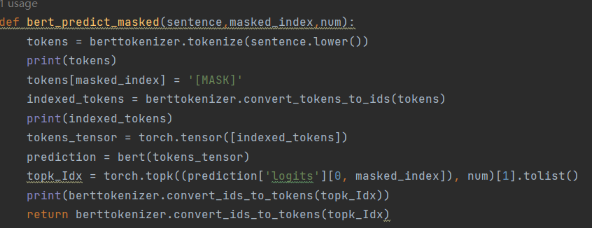

# 面向翻译场景的测试
源于论文：
Machine Translation Testing via Pathological Invariance
## 场景
由于深度神经网络的快速发展，近年来，机器翻译软件已被广泛应用于人们的日常生活，比如与外国人交流或理解邻国的政治新闻。然而，由于底层网络的复杂性，机器翻译软件可能会返回错误的翻译。为了解决这个问题，我们引入了一种名为PaInv的新方法来验证机器翻译软件。我们的关键洞察是，不同含义的句子不应该有相同的翻译（即病态不变性）。
## 测试思想
PaInv通过替换句子中的一个词生成句法上相似但语义上不同的句子，并根据句法和语义信息来过滤不合适的句子。具体来说就是根据原句结构生成一个相似的不相同的新句子，而如果翻译软件对两个句子的翻译相同则证明这次翻译是错误的。
## 代码整体逻辑：

假设传入目标句子A

**生成测试句集**：对A进行单词替换生成与A句法相同的测试句，多个测试句构成测试句集B。

**一次过滤**：根据同义词表对B进行一次过滤，去除所替换词与A中原词相近的句子，得到一次过滤集C。

**二次过滤**：根据C中句子与A相似度进行二次过滤，过滤掉与A相似度过高的句子。得到二次过滤集D。

**翻译**：调用API翻译A与D。

**错误探测**：根据翻译结果进行错误探测，若二次过滤集D中存在与A翻译一致的句子，则对A的翻译有错。  
  
代码框架来源于论文作者的github仓库https://github.com/shashijgupta/PaInv#machine-translation-testing-via-pathological-invariance  
本实验在此基础上做了如下修改：  
1.使用bert微调模型代替nlkt进行词性标注  
2.使用bert tokenizer代替nltk tokenizer  
3.使用openai api对句子进行embedding代替使用tensorflow模型  
4.使用transformers加载bert模型代替原来使用从pytorch_pretrained_bert中获取模型，灵活度更高  
除此之外还在许多细节之处进行修改，再次不一一列举
## 步骤解读
### 1.生成测试句集
（1）进行词性标注，本实验使用bert微调后的模型bert-base-multilingual-cased-pos-english进行词性标注。
对一个输入的句子，标记出其中有意义的单词，具体选择类型如下：

（2）对标注的单词进行掩码[MASK]后使用bert模型进行掩码预测。选出预测的前topk个单词覆盖到被掩码的单词处作为新生成的测试句子。本实验使用了基础的bert模型bert-base-cased。  

示例如下：
可以看到started单词被替换成了had

### 2.一次过滤
对生成的测试句子集合进行第一次过滤，首先使用NLTK的WordNetLemmatizer库对原句和生成的测试句子中的单词进行词形还原，然后使用同义词表过滤掉替换后单词与替换前单词同意的句子。  
下面代码是过滤的核心代码，主要逻辑是如果原句和新生成的句子存在不为同义词的单词，就采用新生成的句子作为测试句。

### 3.二次过滤
对原句子和生成的句子进行相似度分析，如果相似度大于阈值则将生成的句子过滤掉。
实验使用openai的api进行句向量嵌入，使用余弦相似度进行相似度分析。

### 4.翻译
调用想要测试的翻译api接口对原句和生成的句子进行翻译。
bing和google的翻译api需要绑卡，本实验只测试了有道翻译api。
### 5.错误探测
如果存在原句和新生成句子翻译相同的情况，则表明此次翻译不准确。
## 文件说明
main.py:入口  

generate.py：对应步骤1  

filter.py：对应步骤2、3  

translate.py：使用google和bing api进行翻译  

translate_youdao.py：使用有道api进行翻译  

utils.py：transformer模型配置，本实验主要使用了两个bert模型：bert-base-multilingual-cased-pos-english和bert-base-cased  

embeddings_utils.py:提供与open ai交互的方法，也有多种相似度计算方法  

data文件夹：存放同义词库与每一步的中间结果  

如果需要完整运行整个流程，需要在embeddings_utils.py中填写openai apikey  

  
如果想使用其他bert模型可以在utils.py中进行更改  
  

实验使用dataset/business共20条数据对有道翻译进行了检测，结果保存在errors/youdao_error.txt中，文件为空说明并未发现异常。
由于有道翻译的api不太稳定，升级稳定的话要充值...就没有用更多数据进行测试了。

